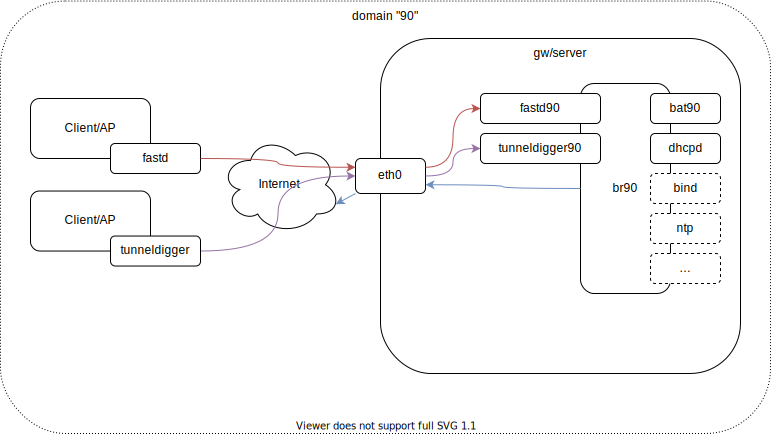

# FFP Gluon Test Gateway

Based on: https://git.bingo-ev.de/freifunk/ansible-ffin/-/tree/master

## Configuration

- Network: 10.22.8.0/21 (10.22.8.1 - 10.0.15.254 / 255.255.248.0)
- Gateway IP: 10.22.8.1
- Domain: "90"

## Servers

- cygnus-5 (cygnus-5 .srv.0xef.de)
  - IPv4, IPv6 (only one /64)
  - hoster: contabo
  - 4in6 tunnel do not work
  - OS: Arch Linux
  - 4 CPUs (Cores)
  - 8GB RAM
  - sshd on port 2424, fingerprints:
    ```
    DSA     SHA256:jeBAPx6yE4cBWZpUX0wTOE0IjWemcnQVEILP1RUws1A
    DSA     MD5:9c:f7:06:c7:d1:75:7d:31:b3:c4:e7:51:c6:d9:7a:be
    ECDSA   SHA256:Pa3y8jkH9GaZFBDUZAAhkPCadQIv33Y9md2tmd8CY3w
    ECDSA   MD5:d3:a2:e9:ee:ff:31:b4:ee:c9:36:15:d0:16:70:94:2f
    ED25519 SHA256:IMUG/fP1g6vEBA49h34XzwbIKMfLwso1SXUIfhzclFU
    ED25519 MD5:a6:60:d2:1e:8a:b0:29:31:3c:85:45:70:d4:d3:cc:6c
    RSA     SHA256:prcAXH1QxDupGIId++nDyXqR3rku/rRkLQ2R9AN8so4
    RSA     MD5:23:e1:25:65:dd:2b:99:dc:db:b9:53:10:e0:45:4f:e0
    ```


## Architecture

The architecture as far as I understand it:



- interface: `fastd90`
  - ingress for clients/APs
  - port: udp/10090
- interface: `tunneldigger90`
  - ingress for clients/APs
  - l2tp
- interface: `bat90`
  - B.A.T.M.A.N batadv interface (server)
- interface: br90
  - interface to bridge:
    - tunnels `fastd90` and `tunneldigger90` (ingress)
    - B.A.T.M.A.N server side `bat90`
  - services:
    - dhcp for clients, IPv4 and IPv6
    - optional:
      - bind for clients/APs name resolution and resolver
      - ntp for clients/APs

### Domains

- testing subnets, one per domain:
  - 10.22.8.0/21
  - 10.22.16.0/21
  - 10.22.24.0/21
- values picked without further thinking

- "90"
  - subnet: 10.22.8.0/21
  - gw ffp ip: 10.22.8.1
  - dhcp range: 10.22.9.0 10.22.10.255

---

# Ansible

## Setup

1. clone repository
1. change into repository
1. create a venv: `python3 -m venv .venv`
1. activate venv: `source .venv/bin/activate`
1. install poetry: `pip install poetry`
1. install dependencies: `poetry install`
1. install ansible dependencies: `ansible-galaxy install -r requirements.yml`
1. run playbook `ansible-playbook -i hosts.yml cygnus-5.yml`

## Notes

- hacked down playbook
- `ansible.builtin.copy` should be replaced with `ansible.builtin.template`
- most tasks should use roles

---

# Manual installation

## Packages to install

- `batctl` (B.A.T.M.A.N)
- `bridge-utils` (`brctl` command)
- `fastd` (fastd legacy tunnel/vpn service), client/ap in
- `haveged` (Entropy harvesting daemon, used by `fastd`?)

## Network Interfaces

### bat90

- `batadv` interface
- gw mode `server`

`/etc/systemd/network/50-bat90.netdev`:
```ini
[NetDev]
Description="BATMAN device for domain '90'"
Name=bat90
Kind=batadv

[BatmanAdvanced]
GatewayMode=server
GatewayBandwidthDown=100M
GatewayBandwidthUp=100M
;RoutingAlgorithm=
```

`/etc/systemd/network/50-bat90.network`:
```ini
[Match]
Name=bat90

[Network]
Bridge=br90
BatmanAdvanced=br90
```

### br90

- bridge interface where interfaces of domain _90_ attach to
  - `bat90`
  - tunnel interfaces

`/etc/systemd/network/50-br90.netdev`:
```ini
[NetDev]
; attach batman and client tunnel endpoints her
Description="Bridge interface for domain '90'"
Name=br90
Kind=bridge
```

`/etc/systemd/network/50-br90.network`:
```ini
[Match]
Name=br90

[Network]
; 10.22.8.1 - 10.0.15.254
; 255.255.248.0
Address=10.22.8.1/21
```

## fastd tunnel/vpn

- clients (APs) connect to it

1. create keypair `fastd --generate-key`
    - write to files `secret.key` and `public.key` (for example to `/etc/fastd/90/`)
    - content: `secret "<secret-key-here>";` / `key "<public-key-here";`, note the `;`
    - `90` is the domain or name, so multiple instances can run
1. create a dummy peer (or it won't start)
    - `/etc/fastd/peers/dummy` with content: `key "THIS-IS-A-DUMMY";`
1. create Configuration file (`/etc/fastd/90/fastd.conf`):
    ```
    # Bind to a fixed address and port, IPv4 and IPv6
    bind <public-ipv4>:10090 interface "eth0";
    bind [<public-ipv6>]:10090 interface "eth0";

    # Set the user, fastd will work as
    user "nobody";

    # Set the interface name
    interface "fastd90";

    # Set the mode, the interface will work as
    mode tap;

    # Set the mtu of the interface
    #mtu 1406;

    # Set the methods (aes128-gcm preferred, salsa2012+umac preferred for nodes)
    method "aes128-gcm";
    method "salsa2012+umac";
    method "salsa2012+gmac";
    method "null";

    # Secret key generated by `fastd --generate-key`
    include "/etc/fastd/90/keys/secret.key";

    # Log everything to syslog
    #log to syslog level warn;

    # Hide IP addresses in log output
    #hide ip addresses yes;

    # Include peers (dummy only)
    include peers from "/etc/fastd/90/peers/";

    # Status Socket
    status socket "/run/fastd-90/fastd.sock";

    # Configure a shell command that is run when fastd comes up
    on up "
      # Add fastd interface to bridge, then enable it
      ip link set dev $INTERFACE master br90 && ip link set dev $INTERFACE up
    ";
    ```
1. enable and start `systemctl enable fastd@90`, `systemctl start fastd@90`

## L2TP

**TODO**

# TODOs

- [ ] Fix dhcp
- [ ] adjust nftables
  - [ ] allow traffic on internal interfaces
  - [ ] nat for IPv4 traffic
- [ ] L2TP
- [ ] IPv6 (ULA?)
- [ ] more services… (dns, ntp, gre, bird…)
